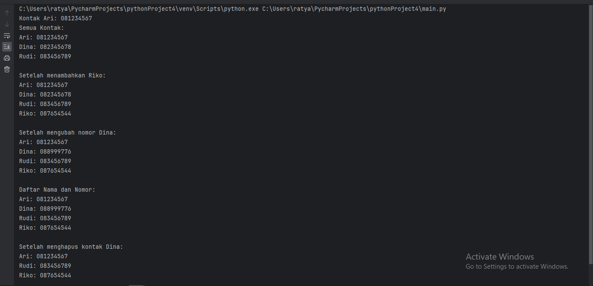

# Pertemuan 10
## Praktikum 5

Buat program sederhana yang akan menampilkan daftar nilai mahasiswa, dengan ketentuan
1. Program dibuat dengan menggunakan Dictionary
2. Tampilkan menu pilihan: (Tambah Data, Ubah Data, Hapus Data, Tampilkan Data, Cari Data)
3. Nilai Akhir diambil dari perhitungan 3 komponen nilai (tugas: 30%, uts: 35%, uas: 35%)
4. Buat flowchart dan penjelasan programnya pada README.md
5. commit dan push repository ke github

```python
x = {}

while True:
    c = input("\n(T)ambah, (U)bah, (H)apus, (C)ari, (L)ihat, (K)eluar: ")

    if c.lower() == 't':
        print("Tambah Data")
        nama = input("Nama           : ")
        nim = int(input("NIM            : "))
        uts = int(input("Nilai UTS      : "))
        uas = int(input("Nilai UAS      : "))
        tugas = int(input("Nilai Tugas    : "))
        akhir = tugas*30/100 + uts*35/100 + uas*35/100
        x[nama] = nim, uts, uas, tugas, akhir

    elif c.lower() == 'u':
        print("Ubah Data")
        nama = input("Masukkan Nama  : ")
        if nama in x.keys():
            nim = int(input("NIM            : "))
            uts = int(input("Nilai UTS      : "))
            uas = int(input("Nilai UAS      : "))
            tugas = int(input("Nilai Tugas    : "))
            akhir = tugas * 30 / 100 + uts * 35 / 100 + uas * 35 / 100
            x[nama] = nim, uts, uas, tugas, akhir
        else:
            print("Nama {0} tidak ditemukan".format(nama))

    elif c.lower() == 'h':
        print("Hapus Data")
        nama = input("Masukkan Nama  : ")
        if nama in x.keys():
            del x[nama]
        else:
            print("Nama {0} Tidak Ditemukan".format(nama))

    elif c.lower() == 'c':
        print("Cari Data")
        nama = input("Masukkan Nama : ")
        if nama in x.keys():
            print("="*73)
            print("|                             Daftar Mahasiswa                          |")
            print("="*73)
            print("| Nama            |       NIM       |  UTS  |  UAS  |  Tugas  |  Akhir  |")
            print("="*73)
            print("| {0:15s} | {1:15d} | {2:5d} | {3:5d} | {4:7d} | {5:7.2f} |"
                  .format(nama, nim, uts, uas, tugas, akhir))
            print("="*73)
        else:
            print("Nama {0} Tidak Ditemukan".format(nama))

    elif c.lower() == 'l':
        if x.items():
            print("="*78)
            print("|                               Daftar Mahasiswa                             |")
            print("="*78)
            print("|No. | Nama            |       NIM       |  UTS  |  UAS  |  Tugas  |  Akhir  |")
            print("="*78)
            i = 0
            for z in x.items():
                i += 1
                print("| {no:2d} | {0:15s} | {1:15d} | {2:5d} | {3:5d} | {4:7d} | {5:7.2f} |"
                      .format(z[0][:13], z[1][0], z[1][1], z[1][2], z[1][3], z[1][4], no=i))
            print("=" * 78)
        else:
            print("="*91)
            print("|                               Daftar Mahasiswa                             |")
            print("="*91)
            print("|No. | Nama            |       NIM       |  UTS  |  UAS  |  Tugas  |  Akhir  |")
            print("="*91)
            print("|                                TIDAK ADA DATA                              |")
            print("="*91)

    elif c. lower() == 'k':
        break

    else:
        print("Pilih menu yang tersedia")
```

## Hasil programnya
### Tambah dan Lihat data

### Ubah data

### Mencari data

### Hapus data dan Keluar


## Latihan 

1. Buat Dictionary daftar kontak Nama sebagai key, dan nomor sebagai value
2. Tampilkan kontaknya Ari
3. Tambah kontak baru dengan nama Riko, nomor 087654544
4. Ubah kontak Dina dengan nomor baru 088999776
5. Tampilkan semua Nama
6. Tampilkan semua Nomor
7. Tampilkan daftar Nama dan nomornya
8. Hapus kontak Dina.

```python
# Membuat dictionary daftar kontak
daftar_kontak = {
    'Ari': '081234567',
    'Dina': '082345678',
    'Rudi': '083456789'
}

# Tampilkan kontak Ari
print("Kontak Ari:", daftar_kontak.get('Ari'))

# Tampilkan semua kontak
print("Semua Kontak:")
for nama, nomor in daftar_kontak.items():
    print(f"{nama}: {nomor}")

# Tambah kontak baru Riko
daftar_kontak['Riko'] = '087654544'
print("\nSetelah menambahkan Riko:")
for nama, nomor in daftar_kontak.items():
    print(f"{nama}: {nomor}")

# Ubah kontak Dina dengan nomor baru
daftar_kontak['Dina'] = '088999776'
print("\nSetelah mengubah nomor Dina:")
for nama, nomor in daftar_kontak.items():
    print(f"{nama}: {nomor}")

# Tampilkan daftar Nama dan nomornya
print("\nDaftar Nama dan Nomor:")
for nama, nomor in daftar_kontak.items():
    print(f"{nama}: {nomor}")

# Hapus kontak Dina
del daftar_kontak['Dina']
print("\nSetelah menghapus kontak Dina:")
for nama, nomor in daftar_kontak.items():
    print(f"{nama}: {nomor}")
```

## Hasil Programnyaa
